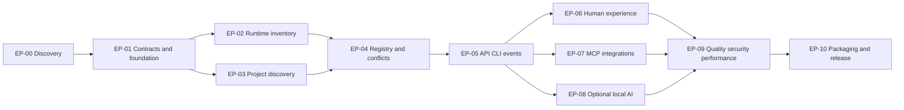

# PortAtlas Initial Backlog

## Backlog policy

This backlog is a product-level plan, not a statement of implementation completion. Priorities use MoSCoW relative to the MVP. Each story links to stable SRS IDs and acceptance scenarios; implementation issues will be added to the [Traceability matrix](../requirements/traceability-matrix.md) after the architecture contracts are approved.

## Dependency order

Parallel implementation begins only after shared domain and API contracts are approved.

## EP-00: Product discovery and decisions

**Priority:** Must
**Outcome:** Evidence-backed product and architecture choices precede code.

| Story | User story | Acceptance/evidence | Depends on |
| --- | --- | --- | --- |
| US-001 | As founder, I can review the product problem, users, scope, metrics, journeys, and risks so that direction is explicit. | Gate 1 document review; `BO-01`–`BO-08` | None |
| US-002 | As architect, I can compare native browser service, Tauri sidecar, and container-plus-helper approaches using current primary sources. | Packaging/architecture ADR proposal | US-001 |
| US-003 | As founder, I can confirm the locked architecture/scope baseline and decide the remaining release inputs and conditional AI inclusion. | Gate 2 baseline confirmation and release-input register | US-002 |

## EP-01: Contracts and engineering foundation

**Priority:** Must
**Outcome:** Shared types, tooling, fixtures, and CI support vertical slices.

| Story | User story | Acceptance/evidence | Depends on |
| --- | --- | --- | --- |
| US-010 | As contributor, I have documented setup, formatting, lint, type, test, and security commands. | Gate 3 CI is green; `SRS-NFR-006`, `SRS-NFR-009` | EP-00 |
| US-011 | As implementer, I use approved domain/state/error/API contracts so parallel work does not invent incompatible schemas. | Contract review and drift checks; `SRS-COL-001`, `SRS-API-001` | US-003 |
| US-012 | As QA engineer, I have synthetic runtime, project, parser, redaction, conflict, and AI-provider fixtures. | Fixture inventory and deterministic test seeds | US-011 |
| US-013 | As security reviewer, I have a threat model before any mutating feature. | Threat-control traceability; `SRS-SEC-002`, `SRS-SEC-003` | US-003 |

## EP-02: Host and Docker runtime inventory

**Priority:** Must
**Outcome:** The system accurately explains live listeners and capability limits.

| Story | User story | Acceptance/evidence | Depends on |
| --- | --- | --- | --- |
| US-020 | As developer, I can inventory macOS TCP/UDP and IPv4/IPv6 listeners with address and timestamp. | `SRS-COL-001`; `AC-001`; Gate 4 real-machine suite | EP-01 |
| US-021 | As developer, I can see process identity using PID plus start time and safely redacted metadata. | `SRS-COL-002`; `AC-001`, `AC-005` | US-020 |
| US-022 | As Docker user, I can distinguish native, internal, exposed, and published host ports with Compose identity. | `SRS-COL-003`; `AC-003` | EP-01 |
| US-023 | As developer, I see reconciled updates, last-known-good state, and named degradation when a collector fails. | `SRS-COL-004`; `SRS-NFR-001`, `SRS-NFR-003`; `SM-04` | US-020, US-022 |

## EP-03: Project discovery and deterministic scanning

**Priority:** Must
**Outcome:** Approved projects produce safe, evidence-backed declarations.

| Story | User story | Acceptance/evidence | Depends on |
| --- | --- | --- | --- |
| US-030 | As developer, I can add, preview, pause, rescan, tag, exclude, and remove approved roots through UI/config. | `SRS-SCN-001`; `AC-006`; `SM-02` | EP-01 |
| US-031 | As developer, I see one logical `Project` with concrete checkout/worktree `ProjectInstance` records, each providing the scan/runtime/allocation boundary. | `SRS-SCN-002`; identity fixtures and corpus | US-030 |
| US-032 | As developer, I can discover exact declarations in priority supported formats. | `SRS-SCN-003`; `AC-002`, `AC-003`; `SM-03` | US-031 |
| US-033 | As privacy-conscious user, I can inspect evidence/confidence while environment secrets and unrelated values remain absent. | `SRS-SCN-004`; `AC-005`; `SM-08` | US-032 |
| US-034 | As developer, I benefit from user-overridable service defaults without defaults being represented as observations. | `SRS-SCN-003`, `SRS-SCN-004`; catalog contract tests | US-032 |

## EP-04: Policies, registry, allocator, and conflicts

**Priority:** Must
**Outcome:** Port coordination is deterministic, explainable, and concurrency-safe.

| Story | User story | Acceptance/evidence | Depends on |
| --- | --- | --- | --- |
| US-040 | As developer, I configure global/project/service ranges, exclusions, interface, reuse, and lease policy. | `SRS-REG-001` | EP-02, EP-03 |
| US-041 | As developer, I receive an explained policy-compliant suggestion and can reserve/release it. | `SRS-REG-002`; `AC-002` | US-040 |
| US-042 | As agent client, I acquire distinct atomic expiring leases under concurrent requests. | `SRS-ALC-001`; `AC-004`, `AC-008`; `SM-07` | US-040 |
| US-043 | As developer, I see normalized current/future, Docker/native, interface/protocol, policy, exposure, and stale conflicts. | `SRS-CNF-001`; `AC-002`, `AC-003`, `AC-007`, `AC-009` | US-041, US-042 |
| US-044 | As developer, I can suppress a finding only with reason and optional expiry, preserving audit. | `SRS-CNF-001`, `SRS-OPS-002` | US-043 |

## EP-05: API, Server-Sent Events, CLI, configuration, and audit

**Priority:** Must
**Outcome:** Every interface uses the same application truth and safe errors.

| Story | User story | Acceptance/evidence | Depends on |
| --- | --- | --- | --- |
| US-050 | As client developer, I use a versioned loopback API, generated contract, cursor pagination, stable errors, and Server-Sent Events. | `SRS-API-001`, `SRS-NFR-001`, `SRS-NFR-008` | EP-04 |
| US-051 | As terminal user, I inspect, scan, check, suggest, reserve, release, preflight, configure, and run MCP with human or JSON output. | `SRS-CLI-001` | US-050 |
| US-052 | As user, I import/export non-secret versioned configuration and recover from invalid configuration/migration. | `SRS-UI-004`, `SRS-OPS-003`; `SM-08`, `SM-11` | US-050 |
| US-053 | As reviewer, I inspect meaningful reads, writes, reservations, integration, configuration, and agent actions without secret leakage. | `SRS-OPS-002`; audit security tests | US-050 |

## EP-06: Setup, dashboard, inventory, projects, and conflicts

**Priority:** Must
**Outcome:** Primary workflows are fast, accessible, and evidence-led.

| Story | User story | Acceptance/evidence | Depends on |
| --- | --- | --- | --- |
| US-060 | As first-time user, I complete privacy/capability/root/policy/integration setup in under five minutes. | `SRS-UI-001`; `AC-006`; `SM-01`, `SM-02` | EP-05 |
| US-061 | As developer, I search/filter/sort/group the overview and port inventory and inspect owner/source in two interactions. | `SRS-UI-002`; `AC-001`; `SM-05`, `SM-10` | US-050 |
| US-062 | As developer, I inspect project instances, services, stack, ports, conflicts, evidence, policy, and activity. | `SRS-UI-003`; `AC-002`, `AC-003` | US-061 |
| US-063 | As developer, I diagnose and safely act on conflict evidence without color-only state or hidden uncertainty. | `SRS-UI-003`, `SRS-NFR-005`; `AC-002`, `AC-003`, `AC-007` | US-061 |
| US-064 | As reviewer, I explore clearly labeled synthetic demo data without granting host access or mixing real state. | `SRS-UI-004`; demo E2E | EP-05 |

## EP-07: MCP and client integrations

**Priority:** Must
**Outcome:** Agents preflight and reserve through permissioned, client-neutral contracts.

| Story | User story | Acceptance/evidence | Depends on |
| --- | --- | --- | --- |
| US-070 | As MCP client, I connect by STDIO or authenticated loopback HTTP and receive concise safety instructions. | `SRS-MCP-001`; transport/auth tests | EP-05 |
| US-071 | As agent, I use typed read-only inventory, project, availability, suggestion, preflight, conflict, policy, evidence, and recent-change tools. | `SRS-MCP-001`; `AC-004`; `SM-06` | US-070 |
| US-072 | As user, I permit only instance-scoped PortAtlas reservation/lease mutation through MCP with validation, authorization, and audit; source-edit, client-config-write, launch, process, and Docker lifecycle tools are absent. | `SRS-MCP-002`, `SRS-SEC-003`; `AC-004`, `AC-013` | US-071 |
| US-073 | As Codex user, I receive copy-ready redacted setup and rollback instructions and can test a configuration I applied myself; PortAtlas does not edit global or project client configuration. | `SRS-MCP-002`; integration UAT | US-070 |
| US-074 | As maintainer, I provide client-neutral logic and thin Claude-compatible instructions without duplicating business rules. | `SRS-MCP-002`; compatibility review | US-073 |

## EP-08: Optional local AI

**Priority:** Should, conditional on release gates
**Outcome:** Local models improve explanation without authority, privacy, or availability regressions.

| Story | User story | Acceptance/evidence | Depends on |
| --- | --- | --- | --- |
| US-080 | As user, I explicitly enable/test an Ollama endpoint and discover installed model capabilities without automatic install/download. | `SRS-AI-001`; AI setup E2E | EP-05, EP-07 |
| US-081 | As user, I ask read-only inventory questions and receive grounded explanations/summaries labeled generated. | `SRS-AI-002`; `AC-011` | US-080 |
| US-082 | As privacy-conscious user, I preview minimized/redacted context and delete AI-derived data. | `SRS-AI-003`; `AC-014`; `SM-08` | US-080 |
| US-083 | As security reviewer, I know malformed output, prompt injection, unsupported tools, timeout, or provider failure cannot mutate core state. | `SRS-AI-003`; `AC-010`, `AC-012`, `AC-013`; `SM-13`, `SM-14` | US-081, US-082 |
| US-084 | As developer, I see AI extraction candidates remain unconfirmed until deterministic evidence or user confirmation. | `SRS-AI-003`; `AC-015` | US-083 |

## EP-09: Quality, security, performance, and UAT

**Priority:** Must
**Outcome:** Evidence covers every Definition-of-Done dimension.

| Story | User story | Acceptance/evidence | Depends on |
| --- | --- | --- | --- |
| US-090 | As QA lead, I run unit, parser-fixture, property, integration, E2E, security, accessibility, and UAT suites mapped to requirements. | `SRS-NFR-009`; traceability has no uncovered Must requirement | EP-02–EP-08 as applicable |
| US-091 | As developer, I use the reference scale without blocking scans or noticeable inventory lag. | `SRS-NFR-001`, `SRS-NFR-002`; `SM-04`, `SM-10` | EP-05, EP-06 |
| US-092 | As security reviewer, I verify path/symlink/command/origin/token/secret/Docker/MCP/AI controls. | `SRS-SEC-002`, `SRS-SEC-003`; `SM-08` | EP-02–EP-08 |
| US-093 | As founder, I complete all applicable acceptance scenarios on real workflows. | `AC-001`–`AC-015`; Gate 7/8 UAT | EP-06–EP-08 |

## EP-10: Packaging and open-source release

**Priority:** Must
**Outcome:** A user installs and operates PortAtlas without cloning the repository.

| Story | User story | Acceptance/evidence | Depends on |
| --- | --- | --- | --- |
| US-100 | As macOS user, I install, start, stop, restart, inspect status/logs, upgrade, roll back, back up, restore, and uninstall. | `SRS-OPS-001`, `SRS-OPS-004`; `SM-01`, `SM-11` | EP-09 |
| US-101 | As user, I can locate and deliberately retain or remove all application/config/data/log files. | `SRS-OPS-001`; lifecycle UAT | US-100 |
| US-102 | As contributor, I have README, architecture, setup, contribution, security, governance, support, issue/PR, changelog, roadmap, and release guidance. | `SRS-NFR-009`; release checklist | EP-09 |
| US-103 | As founder, I review working-name/package-namespace clearance, signing identity, sponsorship handle, exact dependency/license audit, SBOM, UAT, and release notes before publication under Apache-2.0. | Gate 9 approval | US-100–US-102 |

## Deferred backlog themes

The following are Version 1 rather than MVP commitments: managed run; source-change planning, patch generation, and patch application; process/Docker lifecycle control; Linux/Windows; Tauri/tray; health and stale-service detection; history; notifications; shell completion; launcher hooks; development-proxy/devcontainer/VS Code/generic shell or proxy scanners; reverse-proxy aliases; plugins; PostgreSQL team mode; embeddings; AI fallback parsers; and correction memory. They require their own stories and acceptance criteria when promoted.
