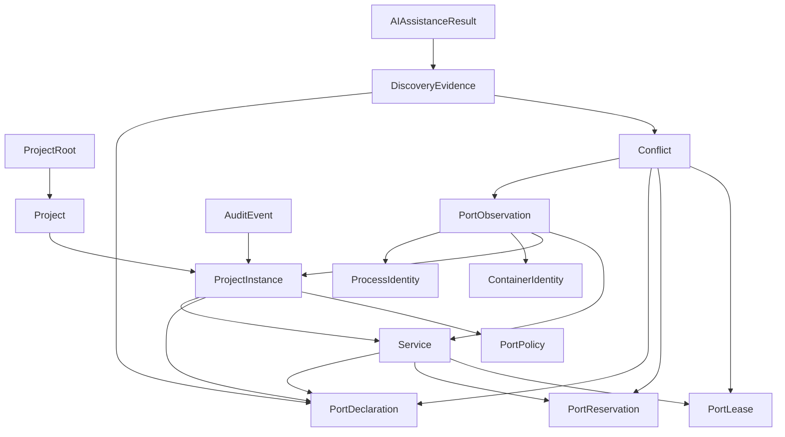

# PortAtlas Information Architecture

## Goals

The information architecture must let a user answer three questions quickly:

1. What is using or expecting this port?
2. Why does PortAtlas believe that?
3. What safe action is available, and what authority does it require?

It preserves distinct state and evidence while keeping common ownership and conflict workflows within one or two interactions.

## Primary navigation

| Area | Purpose | Primary objects/actions |
| --- | --- | --- |
| Overview | Machine-wide status and urgent decisions | Collector/Docker status, counts, critical conflicts, exposures, recent changes, refresh |
| Ports | Unified high-density inventory | Search/filter/sort/group, inspect evidence, reserve, preflight |
| Projects | Logical project and concrete instance/service map | Roots, checkout/worktree `ProjectInstance` identity, stack, ports, policy, evidence, rescan |
| Conflicts | Current and future coordination findings | Diagnose, view evidence, suggest, plan, suppress with reason/expiry |
| Reservations | Persistent assignments and temporary leases | Create, inspect, renew where authorized, release, view owner/expiry |
| Activity | Local audit and reconciliation history | Filter by actor/action/project/result, inspect safe metadata |
| Integrations | MCP/client setup and status | Codex/Claude/generic client, copy-ready configuration, transport, scope, permission, test, rollback guidance |
| Settings | Local configuration and privacy | Roots, scanning, collectors, ranges, catalog, retention, security, AI, import/export |
| Help | Learn and recover | Product truth, assurance levels, setup, troubleshooting, diagnostics, privacy |

## Route model

Route names are conceptual until the frontend-router ADR is approved.

```text
/
/ports
/ports/:protocol/:port
/projects
/projects/:projectId
/projects/:projectId/instances/:instanceId
/projects/:projectId/instances/:instanceId/services/:serviceId
/conflicts
/conflicts/:conflictId
/reservations
/activity
/integrations
/integrations/:clientId
/settings/general
/settings/project-roots
/settings/scanning
/settings/collectors
/settings/port-policies
/settings/security
/settings/ai
/settings/import-export
/help
/setup/*
/demo
```

Every deep link that exposes local identifiers must remain loopback-only by default and respect the local authorization model.

## Core object relationships



The UI must not merge these objects into a single mutable "port" record. A port row is a projection over records with their own sources, timestamps, and authority.

## State vocabulary

| State | User meaning | Authority |
| --- | --- | --- |
| Observed | A listener was seen at runtime | Collector evidence |
| Declared | Configuration references a port | Parser evidence with confidence |
| Reserved | A persistent owner assignment exists | Registry transaction/user or policy action |
| Leased | A short-lived atomic hold awaits launch | Registry transaction with expiry |
| Desired | A reviewed plan proposes a future assignment | Proposal only |
| Conflicted | Records or policy are incompatible | Deterministic conflict engine |
| Stale | Prior evidence no longer matches current state | Reconciliation rule |
| Unknown | Evidence is incomplete | Explicit uncertainty |
| Ignored | User suppresses a finding with reason | User action with audit/optional expiry |
| AI suggested | A model produced an unconfirmed candidate | Non-authoritative generated result |

Each state uses text and iconography in addition to color.

## Page content models

### Overview

- Global search and refresh.
- Collector, Docker, scan, database, MCP, and optional AI status.
- Counts for observations, declarations, reservations, leases, conflicts, projects, and exposures.
- Critical/high conflicts and unexpected wildcard bindings.
- Recent changes and quick actions.
- Degraded-capability explanations without blocking healthy subsystems.

### Ports

- Columns: port, protocol, address, state, source type, project, service, process/PID, container, confidence, health/status, last seen, conflict, actions.
- Filters: activity, state, protocol, native/Docker, project, service type, database, conflict, exposure, range, tags.
- Row detail groups authoritative runtime, declarations, registry state, conflict, evidence, history, and safe actions.

### Project and instance detail

- Logical `Project` identity and aliases, followed by concrete checkout/worktree `ProjectInstance` records with canonical path and Git metadata.
- Services, scans, runtime associations, policies, reservations, leases, and conflicts are scoped to the selected instance.
- Observed/declared/reserved/leased ports and conflicts.
- Evidence sources/confidence, project policy, and activity. Manifest validation is a future contract after its name and scope gates.
- Rescan and preflight; launch/change actions shown only when capability and policy allow.

### Conflict detail

- Severity, machine code, concise cause and impact.
- Affected records and timestamped evidence.
- Interface/protocol and managed/unmanaged assurance explanation.
- Policy-aware alternative and automation-safety classification.
- Dry-run/manual steps, suppression reason/expiry, and audit history.

### Integrations

- Client type and scope, STDIO/HTTP transport, read-only/mutating policy, auth token lifecycle, connection state.
- Copy-ready redacted configuration and rollback guidance; PortAtlas does not edit client files in MVP.
- Explicit warning that client formats may change and global configuration is never silently edited.

### AI Assistant settings

- Default-off provider and loopback endpoint.
- Health/version, installed models, capability results, benchmark profile.
- Per-capability permissions, per-project opt-out, context preview, retention/delete controls.
- Timeout, concurrency, keep-alive, cancellation, background/battery/resource controls.
- Non-authoritative label and deterministic evidence presentation.

## Search and command palette

One keyboard entry point searches ports, projects, services, conflicts, settings, and permitted actions. Results show object type, primary identifier, state, and context. Destructive or mutating actions are never executed directly from a search result; they open a confirmation surface with scope and preview.

## Navigation behavior

- Preserve filters and scroll position when moving between inventory and detail.
- Encode shareable local filters in the URL without embedding secrets or raw paths.
- Support browser back/forward and deep links.
- Display staleness and last-updated time on cached projections.
- Make evidence links return to the originating context.
- Use breadcrumbs only where hierarchy adds meaning; global objects such as conflicts remain first-class.

## Responsive and accessible model

- Desktop: persistent navigation and dense table.
- Narrow screens: collapsible navigation, summary cards, column chooser, and list/detail alternative to horizontal-only tables.
- Full keyboard path through navigation, search, filters, row actions, dialogs, and evidence.
- Programmatic names, visible focus, error summary, status announcements, sufficient contrast, reduced motion, and no color-only distinction.

## Demo-data boundary

Demo mode has an unmistakable global banner and synthetic source labels. It never merges real collector/project state with synthetic records in one unlabeled projection. Leaving demo returns to the prior real view without importing demo changes.

## Related documents

- [Wireframes](wireframes.md)
- [User journeys](user-journeys.md)
- [PRD](prd.md)
- [Functional requirements](../requirements/functional-requirements.md)
